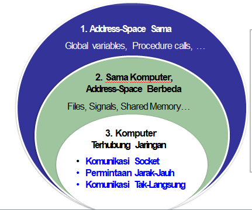

# Komunikasi

## Paradigma Komunikasi

Paradigma komunikasi <mark>menggambarkan</mark> dan <mark>mengelompokkan</mark> metode-metode untuk pertukaran data antar entitas-entitas di dalam suatu sistem terdistribusi.

## Klasifikasi Komunikasi

Paradigma komunikasi dapat dikategorikan ke dalam tiga tipe berdasarkan dimana entitas berada.



Yang akan dibahas adalah entitas yang terhubung jaringan, yaitu:

- Socket Communication, API tingkat rendah untuk kominkasi menggunakan protokol jaringan yang melandasinya
- Remote Invocation, suatu abstraksi pemanggilan prosedur (pada komputer lain) untuk komunikasi antar entitas
- Indirect Communication, komunikasi tanpa ikatan langsung antara sender (penerima) dan receiver (penerima)

### Socket Communication

Socket dalam komputer adalah port. Untuk komunikasi jarak jauh membutuhkan Trigger. Socket merupakan *end-point* komunikasi yang dapat dimanfaatkan oleh aplikasi sebagai tempat untuk menuliskan atau membaca data. Abstraksi Socket digunakan untuk mengirimkan dan menerima pesan dari transport layer dalam jaringan.

Setiap socket dikaitkan dengan tipe tertentu dari transport protocol:

1. **UDP Socket**: Menyediakan komunikasi *connection-less* dan *unreliable*
2. **TCP Socket**: Menyediakan komunikasi *connection-oriented* dan reliable

#### UDP

Pesan dikirim dari proses pengirim ke proses penerima dengan protokol UDP. <mark>UDP menyediakan komunikasi connectionless, tidak ada pengakuan (*ack*) atau percobaan ulang transmisi pesan</mark>.

- Pesan-pesan dapat disampaikan tidak urut (*out-of-order*). Jika diperlukan, programmer harus mengurut-ulangkan paket
- Komunikasi tidak dapat diandalkan. Pesan mungkin hilang karena check-sum error atau buffer overflow di router
- Pengirim harus secara eksplisit memecah (*fragment*) pesan yang panjang menjadi beberapa potongan lebih kecil sebelum transmisi. Ukuran maksimum 548 byte disarankan selama transmisi
- Penerima harus mengalokasikan buffer yang cukup besar menyesuaikan ukuran pesan dari pengirim. Jika tidak maka pesan akan terpotong.

Mekanisme komunikasi:

- Server membuka suatu UDP socket SS pada port tertentu sp,
- Socket SS siap <mark>menerima</mark> (menunggu) suatu permintaan (request)
- Client membuka suatu UDP socket CS pada suatu port acak cx
- CLient socket CS <mark>mengirimkan</mark> pesan ke ServerIP dan port sp
- Server socket SS dapat <mark>mengirimkan</mark> balik data ke CS


#### TCP

Pesan dikirimkan dari sender ke receiver menggunakan protokol TCP. TCP menyediakan penghataran in-order, reliabilitas dan kendali kemacetan.

Mekanisme komunikasi:
1. Server membuka suatu tcp server socket SS pada port tertentu sp
2. Server menunggu menerima request (menggunakan metode accept)
3. Client membuka TCP socket CS pada port acak cx
4. CS mengirim pesan inisiasi koneksi ke ServerIP & sp
5. SS mengalokasikan new socket NSS pada port acak nsp bagi client tersebut
6. CS dapat mengirimkan data ke NSS


Keunggulan TCP antara lain:

- TCP Socket memastikan penyampaian pesan secara in-order (berurutan)
- Aplikasi dapat mengirimkan pesan berukuran berapa pun
- TCP Socket menjamin komunikasi dapat diandalkan menggunakan acknowledgements dan retransmissions
- Kendali kemacetan pada TCP mengatur kecpaatan pengiriman, sehingga mencegah jaringan overload (berbeban lebih)

### Remote Invocation

Remote Invocation (permintaan jarak jauh) memungkinkan suatu entitas memanggil prosedur yang berjalan pada komputer lain <mark>tanpa mengharuskan programmer menulis secara eksplisit rincian kode komunikasi</mark>. Middleware yang melandasi (dan menjembatani) akan mengerjakan urusan komuniaksi mentah (komunikasi jaringan). Programmer dapat secara transparan berkomunikasi dengan entitas jauh (remote). Ada dua jenis remote invocation: Remote Procedure Calls (RPC), dan Remote Method Invocation (RMI)

#### Remote Procedure Call (RPC)

RPC memungkinkan pengirim berkomunikasi dengan penerima melalui pemanggilan metode (procedure call) sederhana.


##### Tantangan RPC

- Parameter passing via Marshaling. Parameter prosedur dan hasilnya harus ditransfer di jaringan sebagai bit-bit
- Representasi data. Representasi data harus seragam. Arsitektur dari mesin pengirim dan penerima boleh berbeda.

###### Parameter Passing Via Marshalling

Parameter marshalling adalah pengemasan parameter untuk prosedur yang dipanggil ke dalam pesan yang akan dikirimkan ke jaringan. Parameter untuk prosedur dan hasilnya harus disusun sebelum mengirimnya ke jaringan. 

Dua jenis parameter yang dapat dikimkan (dilewatkan ke prosedur):

1. Parameter nilai (passing by value)
	Parameter nilai mempunyai informasi lengkap tentang variable & dapat langsung di-enkode-kan ke dalam pesan. Misal integer, float, character.
	
	Nilai dilewatkan melalui call-by-value. Perubahan yang dibuat oleh prosedur callee tidak mengubah nilai dalam prosedur pemanggil (caller)
2. Parameter rujukan (passing by reference)
	Pelewatan parameter rujukan, juga parameter nilai, dalam RPC, menyebabkan hasil tidak tepat dikarenakan 2 hal:
	- Invaliditas dari parameter rujukan di server. Parameter rujukan shahih hanya dalam ruang alamat client. Solusinya adalah lewatkan parameter rujukan dengan menyalin data yang dirujuk
	- Perubahan parameter rujukan tidak dicerminkan balik di client. Solusinya adalah "Copy/Restore" data

###### Representasi Data

Komputer dalam sistem terdistribusi sering mempunyai arsitektur & OS berbeda baik ukuran dari tipe data maupun format data tersimpan. Client & server harus sepakat bagaimana data direpresentasikan di dalam pesan (message). Misal format & ukuran tipe data seperti integer, char, float

##### Bentuk RPC

RPC dapat berbentuk sinkron dan asinkron (atau sinkron tertunda)

- Sinkron: jika berhubungan data A
- Asinkron: jika cuma minta parameter saja
- Sinkron tertunda: agar tidak terputus komunikasinya dengan server.

###### RPC Sinkron vs Asinkron

- Suatu RPC dengan *request-reply* ketat mem-blokir client sampai server mengembalikan. Pemblokiran memboroskan sumber daya di client
- RPC asinkron digunakan jika client tidak perlu hasil dari client.
	- Server langsung mengirimkan ACK balik ke client
	- Client melanjutkan eksekusi seteleah menerima ACK dari server


###### RPC Sinkron Tertunda

RCP asinkron juga berguna saat clietn ingin hasil, tetapi ingin diblok sampai call selesai. Client menggunakan RPC sinkron tertunda (*deffered*)

- Satu request-response dibagi ke dalam dua RPC
- Pertama, client memicu satu RPC asinkron pada server
- Kedua, saat selesai, server *calls-back* client untuk menyampaikan hasilnya.


#### Remote Method Invocation (RMI)

Dalam RMI, pemanggilan obyek dapat invoke metode pada obyek remote berpotensi. RMI mirip RPC, tetapi dalam dunia obyek terdistribusi. Programmer dapat menggunakan *full expressive power* dari pemrograman berorientasi obyek. RMI tidakhanya memungkinkan untuk mengirimkan parameter nilai, juga referensi obyek.

##### Object Remote & Modul

Dalam RMI, obyek yang mempunyai metode dapat diinvoke secara remote dinamakan <mark>obyek remote</mark>. Obyek remote mengimpelementasikan *remote interface*.

Selama suatu panggilan metode, sistem harus menetapkan apakah metode yang idpanggil ada dilokal atau obyek remote. Panggilan lokal akan dipanggilkan pada obyek lokal. Panggilan remote akan dipanggilkan via RMI.

**Modul Referensi Remote** bertanggungjawab  melakukan transalasi antara referensi obyek lokal & remote

##### Alir Kendali RMI


### Komunikasi Tak Langsung

Komunikasi tak-langsung menggunakan middleware untuk:

- Menyediakan komunikasi one-to-many
- Mekanisme eliminasi coupling ruang & waktu
	- Space coupling: Sender & receiver akan saling mengetahui identitas
	- Time coupling: Sender & receiver akan secara eksplisist mendengar setiap kominaksi lain yang berlangsung

#### Middleware

Komunikasi tak langsung dapat dicapai dengan: 

1. Sistem pengantrian pesan (message-queuing)
2. Sistem komunikasi grup

##### Sistem Message-Queuing

Sistem Message Queuing (MQ) menyediakn space and time decoupling antara sender dan receiver. MQ menyediakan kapasitas simpan jangka mengengah untuk pesan (dalam bentuk Antrian), tanpa mensyaratkan sender atau receiver aktif selama komunikasi.


MQ memungkinkan space & time decoupling antara sender dan receivers. Sender & receiver dapat *pasif* selama komunikasi. Namun MQ punya jenis coupling lain:

- Sender & receiver harus mengetahui identitas dari antrian
- Middleware (antrian, queue) harus selalu aktif

4 Kombinasi komunikasi *loosely-coupled* yang mungkin dalam MQ:


###### Interface Sistem MQ

Mesage Queues memungkingkan komunikasi asingkron dengan penyediaan primitf berikut untuk aplikasi:

| Primitif | Maksud                                                                                                   |
| -------- | -------------------------------------------------------------------------------------------------------- |
| PUT      | Tambahkan pesan ke antrian tertentu                                                                      |
| GET      | Blokir sampai antrian tertentu nonempty, dan hapus pesan pertama                                         |
| POLL     | Cek pesan pada antrian tertentu, dan hapus yang pertama. Tidak pernah blokir                             |
| NOTIFY   | Install handler (fungsi call back) untuk dipanggil ketika suatu pesan ditempatkan dalam antrian tertentu | 

###### Arsitektur Sistem MQ

Arsitektur dari sistem MQ harus menuntaskan tantangan berikut:

- Penempatan antrian (queue). Apakah antrian diletakkandekat sender atau receiver ?
- Identitas antrian. Bagaimana sender & receiver dapat mengenali lokasi queue?
- Manajer antrian lanjutan. Dapatkah MQ diskalakan menjadi sistem terdistribusi skala-besar?

###### Penempatan Antrian

Setiap aplikasi punya pola spesifik untuk penyisipan dan penerimaan pesan. Sistem MQ dioptimalkan dengan menempatkan antrian pada suatu lokasi yang meningkatkan kinerja. Biasanya antrian diletakkan pada satu dari dua lokasi:

- Antrian Asal: Queue diletakkan dekat asal
- Antrian Tujuan: Queue diletakkan dekat tujuannya

Contoh:

- “Email Messages” dioptimalkan dengan menggunakan antrian tujuan
- “RSS Feeds” mensyaratkan pengantrian asal.

###### Identitas Antrian

Dalam sistem MQ, antrian sering dialamati dengan nama. Namun, sender & receiver harus peka dengan lokasi jaringan dari antrian.

Layanan penamaan ([naming](Naming)) bagi antrian diperlukan. Database dari nama-nama antrian ke lokasi jaringan dipelihara. Database dapat didistribusikan (mirip dengan DNS)

###### Manager Antrian 

Antrian dikelola oleh Manajer Antrian. Queue Manager secara langsung berinteraksi dengan proses sending & receiving.

Namun, Queue Manager tidak scalable dalam Sister skala-besar dan dinamis. Komputer yang berpartisipasi dalam DS boleh berubah (perubahan topologi dari Sister). Bukan layanan penamaan umum yang tersedia untuk secara  dinamis memetakan nama antrian ke lokasi jaringan

Solusi: membangun suatu overlay network (ms. Relay)

Manajer antrian relay (atau relay) membantu pembangunan sistem MQ yang scalable. Relay bertindak sebagai “routers” untuk pe-rute-an pesan dari sender ke manajer antrian


## Kesimpulan

Beberapa paradigma powerful dan fleksibel untuk komunikasi antar entitas dalam sistem terdistribusi:

- Inter-Process Communication (IPC)
	- IPC menyediakan suatu API komunikasi level rendah
	- Misal Socket API
- Remote Invocation
	- Programmer dapat secara transparan memanggil suatu fungsi jauh dengan menggunakan sitaks procedure-call lokal
	- Misal RPC dan RMI
- Komunikasi Tak-Langsung
	- Memungkinkan paradigma komunikasi one-to-many
	- Memungkinkan decoupling ruang dan waktu

# Naming

Sebuah nama dalam sistem tersebar adalah sebuah deretean karakter yang digunakan untuk mewakili sebuah entitas. Entitas sendiri dapat berupa secara praktis dapat berarti apapun baik yang bersifat fisik seperti: komputer, printer, media penyimpanan, ataupun modem, maupun yang bersifat abstrak (logic) seperti: berkas (file), user, proses, mailbox, dsb.

Untuk memanfaatkan entitas-entitas dalam sistem tersebar, pengguna (manusia ataupun mesin) perlu mengakses entitas-entitas tersebut melalui sesuatu yang disebut access point, address, atau alamat. Sebuah entitas dapat memiliki beberapa alamat seperti halnya seseorang dapat memiliki beberapa nomor telepon genggam. Contoh lainnya adalah ketika seseorang berpindah tempat seperti kota atau negara maka nomor teleponnya sering harus diubah sesuai dengan sistem di kota (kode area) atau negara.

Jenis nama lain yang mendapat perlakuan khusus selain alamat adalah identifier dengan sifat-sifat sebagai berikut :

1. Mewakili paling banyak satu entitas,
2. Setiap entitas diwakili oleh paling banyak satu identifier,
3. Sebuah identifier selalu mewakili entitas yang sama (tidak berubah menurut waktu dan kondisi).

Satu lagi jenis nama penting adalah nama dengan sifat user-friendly yang mudah dibaca dan diingat oleh manusia. Nama ini biasanya terdiri dari sederetan karakter yang dikenali manusia seperti nama pada file atau nama yang digunakan pada Domain Name System seperti www.unmul.ac.id.


Naming system memiliki beberapa kategori penamaan, antara lain :

- Flat Naming
- Structured Naming
- Atrribute Based Naming

## Flat Naming

Adalah penamaan yang tidak memiliki struktur tertentu. Nama dalam Flat Naming terdiri dari sederetan bit karakter yang tidak mengandung informasi tentang bagaimana menemukan alamat untuk entitas yang diwakili oleh nama tersebut.

Teknik Resolving. Ada beberapa solusi dalam menyelesaikan masalah menemukan pasangan alamat/menerjemahkan nama menjadi alamat (resolving) pada sistem penamaan flat naming, yaitu:

1. Broadcasting & Multicasting
2. Forwarding pointer
3. Home-based approach
4. Hierarchical search tree

### Broadcasting & Multicasting

**Broadcasting** : Mengirimkan sebuah pesan berisi permintaan pasangan identifier dari sebuah alamat kepada seluruh atau sebagian anggota jaringan dan hanya entitas yang memiliki alamat tersebut yang akan menjawab dengan identifier yang ia miliki. Contoh: ARP


**Multicasting** : Mengirimkan pesan hanya ke beberapa entitas dalam jaringan. Contoh: Pada unit bergerak seperti laptop milik pegawai yang terkoneksi dengan jaringan nirkabel, membangun group yang membatasi antar unit/divisi.


### Forwarding Pointer

Pada teknik ini setiap kali sebuah entitas berpindah lokasi dan mendapatkan alamat baru maka entitas tersebut meninggalkan informasi mengenai lokasi barunya di lokasi lamanya sedemikian sehingga entitas lain yang mencarinya dapat menelusuri jejak perpindahan dan berkomunikasi dengan entitas tersebut.

Contoh: *Stub-Scion Pair (SSP) Chain*

- Menerapkan remote invocations bagi entitas mobile menggunakan forwarding pointer.
- Setiap forwarding poiter diimplementasikan sebagai satu pasangan.


### Home Based Approach

Home Based Approch adalah sebuah teknik resolving sedemikian sehingga sebuah entitas bergerak memiliki entitas agen dengan sebuah alamat tetap yang menjadi 'alamat rumah’. Contoh: Mobile IP Address


### Hierarchical Search Tree

Pada teknik ini jaringan dibagi-bagi menjadi beberapa bagian yang dikenal sebagai domain. Contoh

- Top-level-domain : https://unmul.ac.id
- Sub-domain : https://fkti.unmul.ac.id
- Leaf-domain : https://fkti.unmul.ac.id/visi_misi.php


## Structured Naming

Sistem penamaan biasanya mendukung penggunaan nama yang terstruktur yang dibentuk dari beberapa nama yang sederhana dan mudah dikenali manusia. Name Space : Nama-nama biasanya diatur menjadi sesuatu yang dikenal sebagai ruang nama (name space). Name space untuk nama yang terstruktur dapat direpresentasikan dalam bentuk graph.

### Name Space

Ada dua macam simpul pada graph yang merepresentasikan name space, yaitu:

1. Simpul daun yang merepresentasikan entitas yang memiliki nama dan tidak menjadi induk dari simpul lainnya
2. Simpul direktori yang memiliki ujung-ujung yang bernama dan menunjuk pada dari simpul daun lain.


Name Space dapat  secara  efektif digunakan untuk mengaitkan (menghubungkan, membuat link) dua entitas berbeda.

Dua jenis link dapat hadir antara node-node:

1. Hards links
2. Symbolic Links

#### Hard Links

Ada suatu directed link dari hard  link (name link) ke actual node  (node sebenarnya). Name resolution serupa dengan name resolution yang umum. Aturan yang harus dipatuhi dalam hard links adalah tidak ada siklus dalam graf.


#### Symbolic Links

Symbolic link menyimpan nama dari node asli sebagai data. 

Resolusi nama bagi suatu symbolic link SL:

1. Resolve nama SL
2. Baca isi dari SL
3. Resolusi nama berlanjut dengan isi dari SL

Aturan yang harus dipatuhi adalah tidak diperbolehkan muncul reference cycle.

### Name Resolution

Name resolution merupakan istilah untuk proses pencarian (looking up) sebuah nama ketika kita mendapatkan path dari nama tersebut. Proses name resolution ini akan menghasilkan identifier dari sebuah simpul yang dilalui pada proses tersebut.

### Merged Name Space

Dua atau lebih name space dapat digabungkan (merged) secara  transparan dengan suatu teknik yang dikenal sebagai mounting. Dengan mounting, suatu directory node dalam satu ruang nama akan  menyimpan identifier dari directory node dari suatu name space lain. Network File System (NFS) adalah contoh dimana ruang nama berbeda  digabungkan (mounted)

> NFS memungkinkan akses transparan ke file-file remote


### Name Space Distributed

Dalam sistem terdistribusi skala besar, penting sekali mendistribusikan  name space ke banyak server (name servers).

- Mendistribusikan node-node dari graph name
- Mendistribusikan manajemen name space tersebut
- Mendistribusikan mekanisme name resolution

#### Name Space Distributed Layering

Ruang nama terdistribusi dapat dibagi ke dalam 3 layer:


Contoh: DNS


### Name Resolution Distributed

Name Resolution Distributed bertanggung jawab untuk memetakan nama-nama kealamat dalam suatu sistem dimana:

- Server-server nama didistribusikan antar node-node yang berpartisipasi
- Setiap server nama mempunyai suatu name resolver lokal

Ada dua algoritma resolusi nama terdistribusi:

- Interactive name resolution
- Recursive name resolution

#### Interactive Name Resolution

1. Client menyerahkan nama lengkap yang akan dipecahkan ke root name server.
2. Root name server memecahkan (resolve) nama sejauh kemampuannya dan  mengembalikan hasilnya kepada client. 

	> Root name server juga mengembalikan alamat dari server namalevelselanjutnya (disingkat NLNS) jika alamat tidak terpecahkan secara lengkap.

3. Client melewatkan bagian yang tidak terpecahkan dari nama ke NLNS
4. NLNS memecahkan nama sejauh kemampuannya dan mengembalikanhasilnyakepada client (bersama dengan next-level name server-nya)
5. Proses ini berlanjut sampai nama lengkap terpecahkan


#### Recursive Name Resolution

1. Client menyerahkan nama yang akan dipecahkan kepada root name server.
2. Root name server tersebut melewatkan hasilnya ke next name server yang  ditemukannya.
3. Proses berlanjut sampai nama tersebut secara lengkap terpecahkan.
4. Memiliki kekurangan biaya besar pada name server (terutama pada server nama tingkat tinggi).


## Attribute Based Naming

Seiring bertambahnya informasi yang dapat diakses dari sebuah entitas maka diperlukan sebuah cara agar pengguna dapat mencari dan mengakses suatu entitas dengan memberikan keterangan mengenai entitas. Salah satu cara yang populer adalah menggunakan attribute based naming (penamaan berbasiskan atribut). Dengan teknik ini sebuah entitas diasosiasikan dengan sejumlah atribut yang memiliki nilai tertentu.

Pengguna melakukan pencarian berdasarkan kriteria tertentu berupa jenis dan nilai atribut yang dimiliki entitas yang dicarinya. Sistem penamaan berdasarkan atribut lebih sering dikenal sebagai directory service sedangkan sistem penamaan terstruktur lebih dikenal sebagai naming System. Pada directory service entitas memiliki beberapa atribut yang dapat digunakan sebagai kriteria pencarian.

Contoh: Light-weight Directory Access Protocol (LDAP)

### LDAP

Layanan direktori LDAP terdiri dari sejumlah record bernama “directory  entries”.

- Setiap record tersusun dari pasangan (attribute, value).
- Standard LDAP menetapkan lima atribut untuk setiap record.

Directory Information Base (DIB) adalah koleksi semua directory entries.

- Setiap record dalam DIB bersifat unik.
- Setiap record direpresentasikan oleh suatu nama yang membedakan.

#### Directory Information Tree LDAP

Semua record dalam DIB dapat  ditata ke dalam suatu pohon  hirarkis bernama Directory  Information Tree (DIT). LDAP menyediakan mekanisme  pencarian lanjut berdasarkan pada  atribut dengan melintasi DIT  tersebut. Contoh sintaks untuk pencarian  semua Main_Servers di dalam Vrije  Universiteit:

```
search("&(C = NL) (O = Vrije Universiteit) (OU = *) (CN = Mainserver)")
```


# Sinkronisasi

## Clock Synchronization

Sifat algoritma untuk sinkronisasi dalam sistem terdistribusi :

- Informasi yang relevan tersebar di beberapa komputer
- Keputusan pembuatan proses hanya berdasarkan informasi local
- Peristiwa kegagalan dengan penyebab tunggal di dalam sistem harus dihindarkan
- Tidak tersedianya clock atau sumber waktu global yang akurat.

Sikronisasi merupakan bagian penting untuk kerjasama dalam :

- Pemakaian sumberdaya berbagi (Sharing resources)
- Pengurutan kejadian
- Kesepakatan clock tersebar

Contoh tidak adanya kesepakatan clock global


Cara yang paling mudah untuk menentukan waktu adalah dengan bertanya langsung ke server waktu (UTC), hanya saja akan banyak perbedaan dalam request. Mungkinkah mensinkronkan semua clock yang ada dalam sistem tersebar?

## Logic Clock

Walaupun penggunakan kata clock sudah meluas, kata yang lebih tepat adalah timer untuk merujuk komponen dari rangkaian tersebut. Selalu ada sedikit perbedaan yang terjadi dan mengakibatkan perbedaan waktu yang disebut clock skew. Salah satu algoritma logic clock adalah Algoritma Lamport.

### Algoritma Lamport

Menurut Lamport, sikronisasi clock tidak harus dilakukan dengan nilai mutlak clocknya, karena yang diperlukan dalam sikronisasi proses-proses adalah urutan proses tersebut. Jadi yang dipentingkan adalah konsistensi internal clock, bukan apakah clock tersebut harus sama persis dengan waktu real.

### Physical Clock

Pada beberapa sistem, waktu clock actual menjadi penting, contohnya real-time sistem. Untuk mendapatkan presisi yang sangat akurat diperlukan clock fisik eksternal. Physical clock dibagi menjadi 2 type: External clock synchronization dan Internal clock synchronization. Salah satu contoh sinkronisasi dengan physical clock adalah sistem waktu UTC (Universal Time Coordination).

# Consistency & Replication

## Replikasi

**Replikasi** adalah suatu teknik untuk melakukan copy dan pendistribusian data dan objek-objek serta melaksanakan sinkronisasi antara objek sehingga konsistensi data dapat terjamin.

Keuntungan replikasi: replikasi mendukung ketersediaan data setiap waktu dan dimanapun diperlukan.

Secara umum dibagi 2:
- Reliability

	Satu sistem, atau bahkan lebih dari satu, dapat terjadi tabrakan tanpa akses ke data yang mengalami interrupt. Memiliki salinan data dan mengijinkan data yang corrupt agar mudah dalam proses pendeteksian dan perbaikan.
	
- Performance

	Beberapa salinan data dapat membantu dari sisi skala sehingga mampu menangani sistem yang lebih besar menangani client

Keuntungan lain yaitu:

- Memungkinkan beberapa lokasi menyimpan data yang sama.
- Aplikasi transaksi online terpisah dari aplikasi pembacaan
- Memungkinkan otonomi yang besar
- Data dapat ditampilkan pembacaan
- Membawa data mendekati lokasi pengguna
- Penggunaan replikasi sebagai bagian dari strategi standby server

Kebutuhan replikasi:

- Meng-copy dan mendistribusikan data dari satu atau lebih lokasi
- Mendistribusikan hasil copy data berdasarkan jadwal
- Mendistribusikan perubahan data ke server lain
- Memungkinkan beberapa pengguna di beberapa lokasi untuk melakukan perubahan dan kemudian menggabungkan data yang telah dimodifikasi
- Membangun aplikasi data yang menggunakan perlengkapan online maupun offline
- Membangun aplikasi Web sehingga pengguna dapat melihat volume data yang besar.

Pertimbangan dalam perencanaan replikasi:

- Kebutuhan data yang akan diubah dan siapa yang mengubah
- Pendistribusian data memerlukan konsistensi, otonomi dan kesinambungan
- Kelengkapan replikasi yang meliputi kebutuhan user, infra struktur teknik,jaringan dan keamanan serta karakteristik data
- Jenis replikasi dan pilihannya
- Topologi replikasi dan bagaimana mewujudkannya agar sesuai dengan jenis replikasi

### Jenis Replikasi

Bedasarkan jenisnya replikasi dibagi atas beberapa macam, antara lain:

- Snapshot Replication 
- Transactional Replication
- Marge Replication

#### Snapshot Replication

Mendistribusikan data yang dapat dilihat pada saat tertentu tanpa melakukan update. Biasanya digunakan pada saat memerlukan tampilan data (read-only). Contoh : daftar harga, katalog, data yang digunakan untuk pengambilan keputusan.

Replikasi snapshot ini membantu pada saat:

- Data sebagian besar statis dan tidak sering berubah
- Dapat menerima copy data yang telah melewati batas waktu yang ditentukan
- Datanya sedikit

#### Transactional Replication

Replikasi transaksional adalah distribusi periodik otomatis dari perubahan antar database. Data disalin dalam waktu dekat atau secara periodik dari server utama ke database penerima, atau sebaliknya. Replikasi Transaksional di gunakan untuk memelihara kekonsistenan transaksi yang terjadi. Contoh : daftar transfer, debit, atau kredit dari database nasabah ke server utama bank.

## Konsistensi

Konsistensi semantik menunjukkan karakteristik sistem yang menspesifikasi semantik dari pengguna ganda yang mengakses berkas yang sama secara simultan. Konsistensi semantik berhubungan langsung dengan algoritma pada proses sinkronisasi.

### Konsistensi dalam Sistem Terdistribusi

Beberapa contoh penting konsistensi Semantik:

- **UNIX Semantics**. Apa yang ditulis pengguna pada sebuah open files dapat dilihat pengguna lain yang juga sedang membuka berkas yang sama Sharing memungkinkan pengguna untuk berbagi pointer.
- **Session Semantics**. Apa yang ditulis pengguna pada sebuah open files tidak dapat dilihat pengguna lain yang juga sedang membuka berkas yang sama. Setelah berkas itu di-close, perubahan yang terjadi karena ada pengguna yang menulis berkas dapat dilihat.
- **Immutable-Shared Files Semantics**. Sebuah immutable berkas tidak dapat dimodifikasi. Walaupun beberapa pengguna mengakses immutable file, isi berkas tidak dapat diubah.

### Jenis Model Konsistensi

Ada beberapa jenis model konsistensi, yaitu :
1. Model konsistensi berpusat pada data (Data- Centric Consistency Models)
2. Model konsistensi berpusat pada client (Client- Centric Consistency Models)

#### Data-Centric Consistency Models

Model konsistensi dapat membatasi nilai pada saat proses Read sehingga proses pengembalian data data dapat dilakukan. Beberapa diantaranya dibatasi, semakin terbatas pembatasan nilai yang ada semakin mudah diterapkan. Ada dua model yang umum digunakan dalam Data-Centric Consistency, yaitu: *Sequential Consistency* dan *Casual Consistency*

##### Sequential Consitency

Digunakan untuk shared memory pada sistem multiprosesor. Dalam data store dikatakan sequentialy consistent apabila hasil dari tiap eksekusi adalah sama jika operasi read dan write untuk seluruh proses di data store diekseskusi pada beberapa perintah yang terurut (sequential) dan operasi untuk setiap proses terlihat pada urutan yang diperintah secara spesifik oleh program.

Ilustrasi: (a) Konsistensi secara terurut, namun konsisten. (b) Tidak menggunakan keterurutan konsistensi


#### Client-Centric Consistency Models

Kita berasumsi bahwa tidak ada proses update secara simultan terhadap penyimpanan data. Kita perhatikan untuk Domain Name System atau World Wide Web:

- Di dalam sistem ini, mayoritas operasi itu terbaca, dan sangat utama semua menulis dilaksanakan oleh penguasa pusat (pemilik-pemilik halaman web, hostmasters), jadi kita tidak pernah mempunyai write-write conflicts.
- Jika tidak ada update berlangsung dalam jangka waktu lama, semua replika akan secara berangsur-angsur dijadikan konsisten (data lama akan dihapus dari cache).
- Proses ini disebut sebagai eventual consistency.


### Protokol dalam Konsistensi

Protokol ppada konsistensi digunakan untuk menguraikan lebih dalam mengenai model konsistensi. Ada tiga protokol yaitu:

- **Primary-based protocol**. Remote-write protocols & local-write protocols
- **Replicated-write protocols**. Active replication & quorum-based protocols
- **Cache coherence protocols**

# Fault Tolerance

## Komponen

Sistem dikatakan gagal (fail) apabila tidak mampu memenuhi spesifikasi tekniknya. Sistem Komputer dapat gagal karena kesalahan beberapa komponen seperti : processor, memory, I/O device, cable atau software.

## Klasifikasi

Fault tolerance dapat diklasifikasikan menjadi:

- **Transient** : muncul sekali & menghilang
- **Intermittent** : muncul – menghilang & muncul lagi
- **Permanent** : muncul seterusnya sampai komponen diperbaiki

## System Failures

Kesalahan suatu system dibedakan menjadi:

- **Fail-silent faults** : sistem berhenti & tidak dapat memberikan respon terhadap masukan yang ada.
- **Bizantine faults** : sistem terus bekerja meskipun fault dan memberikan hasil yang salah.

Sistem Sistem yang mempunyai sifat dalam kondisi normal bekerja akan memberikan respon terhadap input dalam waktu terbatas yang telah diketahui disebut sistem Synchronous. Sebaliknya disebut asynchronous.