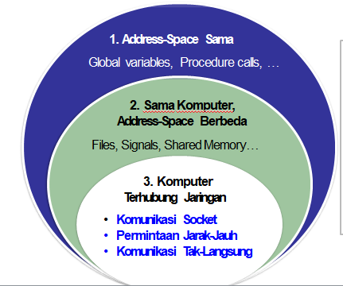

## Paradigma Komunikasi

Paradigma komunikasi <mark>menggambarkan</mark> dan <mark>mengelompokkan</mark> metode-metode untuk pertukaran data antar entitas-entitas di dalam suatu sistem terdistribusi.

## Klasifikasi Komunikasi

Paradigma komunikasi dapat dikategorikan ke dalam tiga tipe berdasarkan dimana entitas berada.

Yang akan dibahas adalah entitas yang terhubung jaringan, yaitu:

- Socket Communication, API tingkat rendah untuk kominkasi menggunakan protokol jaringan yang melandasinya
- Remote Invocation, suatu abstraksi pemanggilan prosedur (pada komputer lain) untuk komunikasi antar entitas
- Indirect Communication, komunikasi tanpa ikatan langsung antara sender (penerima) dan receiver (penerima)

### Socket Communication

Socket dalam komputer adalah port. Untuk komunikasi jarak jauh membutuhkan Trigger. Socket merupakan *end-point* komunikasi yang dapat dimanfaatkan oleh aplikasi sebagai tempat untuk menuliskan atau membaca data. Abstraksi Socket digunakan untuk mengirimkan dan menerima pesan dari transport layer dalam jaringan.

Setiap socket dikaitkan dengan tipe tertentu dari transport protocol:

1. **UDP Socket**: Menyediakan komunikasi *connection-less* dan *unreliable*
2. **TCP Socket**: Menyediakan komunikasi *connection-oriented* dan reliable

#### UDP

Pesan dikirim dari proses pengirim ke proses penerima dengan protokol UDP. <mark>UDP menyediakan komunikasi connectionless, tidak ada pengakuan (*ack*) atau percobaan ulang transmisi pesan</mark>.

- Pesan-pesan dapat disampaikan tidak urut (*out-of-order*). Jika diperlukan, programmer harus mengurut-ulangkan paket
- Komunikasi tidak dapat diandalkan. Pesan mungkin hilang karena check-sum error atau buffer overflow di router
- Pengirim harus secara eksplisit memecah (*fragment*) pesan yang panjang menjadi beberapa potongan lebih kecil sebelum transmisi. Ukuran maksimum 548 byte disarankan selama transmisi
- Penerima harus mengalokasikan buffer yang cukup besar menyesuaikan ukuran pesan dari pengirim. Jika tidak maka pesan akan terpotong.

Mekanisme komunikasi:

- Server membuka suatu UDP socket SS pada port tertentu sp,
- Socket SS siap <mark>menerima</mark> (menunggu) suatu permintaan (request)
- Client membuka suatu UDP socket CS pada suatu port acak cx
- CLient socket CS <mark>mengirimkan</mark> pesan ke ServerIP dan port sp
- Server socket SS dapat <mark>mengirimkan</mark> balik data ke CS

#### TCP

Pesan dikirimkan dari sender ke receiver menggunakan protokol TCP. TCP menyediakan penghataran in-order, reliabilitas dan kendali kemacetan.

Mekanisme komunikasi:
1. Server membuka suatu tcp server socket SS pada port tertentu sp
2. Server menunggu menerima request (menggunakan metode accept)
3. Client membuka TCP socket CS pada port acak cx
4. CS mengirim pesan inisiasi koneksi ke ServerIP & sp
5. SS mengalokasikan new socket NSS pada port acak nsp bagi client tersebut
6. CS dapat mengirimkan data ke NSS

Keunggulan TCP antara lain:

- TCP Socket memastikan penyampaian pesan secara in-order (berurutan)
- Aplikasi dapat mengirimkan pesan berukuran berapa pun
- TCP Socket menjamin komunikasi dapat diandalkan menggunakan acknowledgements dan retransmissions
- Kendali kemacetan pada TCP mengatur kecpaatan pengiriman, sehingga mencegah jaringan overload (berbeban lebih)

### Remote Invocation

Remote Invocation (permintaan jarak jauh) memungkinkan suatu entitas memanggil prosedur yang berjalan pada komputer lain <mark>tanpa mengharuskan programmer menulis secara eksplisit rincian kode komunikasi</mark>. Middleware yang melandasi (dan menjembatani) akan mengerjakan urusan komuniaksi mentah (komunikasi jaringan). Programmer dapat secara transparan berkomunikasi dengan entitas jauh (remote). Ada dua jenis remote invocation: Remote Procedure Calls (RPC), dan Remote Method Invocation (RMI)

#### Remote Procedure Call (RPC)

RPC memungkinkan pengirim berkomunikasi dengan penerima melalui pemanggilan metode (procedure call) sederhana.

##### Tantangan RPC

- Parameter passing via Marshaling. Parameter prosedur dan hasilnya harus ditransfer di jaringan sebagai bit-bit
- Representasi data. Representasi data harus seragam. Arsitektur dari mesin pengirim dan penerima boleh berbeda.

###### Parameter Passing Via Marshalling

Parameter marshalling adalah pengemasan parameter untuk prosedur yang dipanggil ke dalam pesan yang akan dikirimkan ke jaringan. Parameter untuk prosedur dan hasilnya harus disusun sebelum mengirimnya ke jaringan. 

Dua jenis parameter yang dapat dikimkan (dilewatkan ke prosedur):

1. Parameter nilai (passing by value)
	Parameter nilai mempunyai informasi lengkap tentang variable & dapat langsung di-enkode-kan ke dalam pesan. Misal integer, float, character.
	
	Nilai dilewatkan melalui call-by-value. Perubahan yang dibuat oleh prosedur callee tidak mengubah nilai dalam prosedur pemanggil (caller)
2. Parameter rujukan (passing by reference)
	Pelewatan parameter rujukan, juga parameter nilai, dalam RPC, menyebabkan hasil tidak tepat dikarenakan 2 hal:
	- Invaliditas dari parameter rujukan di server. Parameter rujukan shahih hanya dalam ruang alamat client. Solusinya adalah lewatkan parameter rujukan dengan menyalin data yang dirujuk
	- Perubahan parameter rujukan tidak dicerminkan balik di client. Solusinya adalah "Copy/Restore" data

###### Representasi Data

Komputer dalam sistem terdistribusi sering mempunyai arsitektur & OS berbeda baik ukuran dari tipe data maupun format data tersimpan. Client & server harus sepakat bagaimana data direpresentasikan di dalam pesan (message). Misal format & ukuran tipe data seperti integer, char, float

##### Bentuk RPC

RPC dapat berbentuk sinkron dan asinkron (atau sinkron tertunda)

- Sinkron: jika berhubungan data A
- Asinkron: jika cuma minta parameter saja
- Sinkron tertunda: agar tidak terputus komunikasinya dengan server.

###### RPC Sinkron vs Asinkron

- Suatu RPC dengan *request-reply* ketat mem-blokir client sampai server mengembalikan. Pemblokiran memboroskan sumber daya di client
- RPC asinkron digunakan jika client tidak perlu hasil dari client.
	- Server langsung mengirimkan ACK balik ke client
	- Client melanjutkan eksekusi seteleah menerima ACK dari server

###### RPC Sinkron Tertunda

RCP asinkron juga berguna saat clietn ingin hasil, tetapi ingin diblok sampai call selesai. Client menggunakan RPC sinkron tertunda (*deffered*)

- Satu request-response dibagi ke dalam dua RPC
- Pertama, client memicu satu RPC asinkron pada server
- Kedua, saat selesai, server *calls-back* client untuk menyampaikan hasilnya.

#### Remote Method Invocation (RMI)

Dalam RMI, pemanggilan obyek dapat invoke metode pada obyek remote berpotensi. RMI mirip RPC, tetapi dalam dunia obyek terdistribusi. Programmer dapat menggunakan *full expressive power* dari pemrograman berorientasi obyek. RMI tidakhanya memungkinkan untuk mengirimkan parameter nilai, juga referensi obyek.

##### Object Remote & Modul

Dalam RMI, obyek yang mempunyai metode dapat diinvoke secara remote dinamakan <mark>obyek remote</mark>. Obyek remote mengimpelementasikan *remote interface*.

Selama suatu panggilan metode, sistem harus menetapkan apakah metode yang idpanggil ada dilokal atau obyek remote. Panggilan lokal akan dipanggilkan pada obyek lokal. Panggilan remote akan dipanggilkan via RMI.

**Modul Referensi Remote** bertanggungjawab  melakukan transalasi antara referensi obyek lokal & remote

##### Alir Kendali RMI

### Komunikasi Tak Langsung

Komunikasi tak-langsung menggunakan middleware untuk:

- Menyediakan komunikasi one-to-many
- Mekanisme eliminasi coupling ruang & waktu
	- Space coupling: Sender & receiver akan saling mengetahui identitas
	- Time coupling: Sender & receiver akan secara eksplisist mendengar setiap kominaksi lain yang berlangsung

#### Middleware

Komunikasi tak langsung dapat dicapai dengan: 

1. Sistem pengantrian pesan (message-queuing)
2. Sistem komunikasi grup

##### Sistem Message-Queuing

Sistem Message Queuing (MQ) menyediakn space and time decoupling antara sender dan receiver. MQ menyediakan kapasitas simpan jangka mengengah untuk pesan (dalam bentuk Antrian), tanpa mensyaratkan sender atau receiver aktif selama komunikasi.

MQ memungkinkan space & time decoupling antara sender dan receivers. Sender & receiver dapat *pasif* selama komunikasi. Namun MQ punya jenis coupling lain:

- Sender & receiver harus mengetahui identitas dari antrian
- Middleware (antrian, queue) harus selalu aktif

4 Kombinasi komunikasi *loosely-coupled* yang mungkin dalam MQ:

###### Interface Sistem MQ

Mesage Queues memungkingkan komunikasi asingkron dengan penyediaan primitf berikut untuk aplikasi:

| Primitif | Maksud                                                                                                   |
| -------- | -------------------------------------------------------------------------------------------------------- |
| PUT      | Tambahkan pesan ke antrian tertentu                                                                      |
| GET      | Blokir sampai antrian tertentu nonempty, dan hapus pesan pertama                                         |
| POLL     | Cek pesan pada antrian tertentu, dan hapus yang pertama. Tidak pernah blokir                             |
| NOTIFY   | Install handler (fungsi call back) untuk dipanggil ketika suatu pesan ditempatkan dalam antrian tertentu | 

###### Arsitektur Sistem MQ

Arsitektur dari sistem MQ harus menuntaskan tantangan berikut:

- Penempatan antrian (queue). Apakah antrian diletakkandekat sender atau receiver ?
- Identitas antrian. Bagaimana sender & receiver dapat mengenali lokasi queue?
- Manajer antrian lanjutan. Dapatkah MQ diskalakan menjadi sistem terdistribusi skala-besar?

###### Penempatan Antrian

Setiap aplikasi punya pola spesifik untuk penyisipan dan penerimaan pesan. Sistem MQ dioptimalkan dengan menempatkan antrian pada suatu lokasi yang meningkatkan kinerja. Biasanya antrian diletakkan pada satu dari dua lokasi:

- Antrian Asal: Queue diletakkan dekat asal
- Antrian Tujuan: Queue diletakkan dekat tujuannya

Contoh:

- “Email Messages” dioptimalkan dengan menggunakan antrian tujuan
- “RSS Feeds” mensyaratkan pengantrian asal.

###### Identitas Antrian

Dalam sistem MQ, antrian sering dialamati dengan nama. Namun, sender & receiver harus peka dengan lokasi jaringan dari antrian.

Layanan penamaan ([naming](Naming)) bagi antrian diperlukan. Database dari nama-nama antrian ke lokasi jaringan dipelihara. Database dapat didistribusikan (mirip dengan DNS)

###### Manager Antrian 

Antrian dikelola oleh Manajer Antrian. Queue Manager secara langsung berinteraksi dengan proses sending & receiving.

Namun, Queue Manager tidak scalable dalam Sister skala-besar dan dinamis. Komputer yang berpartisipasi dalam DS boleh berubah (perubahan topologi dari Sister). Bukan layanan penamaan umum yang tersedia untuk secara  dinamis memetakan nama antrian ke lokasi jaringan

Solusi: membangun suatu overlay network (ms. Relay)

Manajer antrian relay (atau relay) membantu pembangunan sistem MQ yang scalable. Relay bertindak sebagai “routers” untuk pe-rute-an pesan dari sender ke manajer antrian

## Kesimpulan

Beberapa paradigma powerful dan fleksibel untuk komunikasi antar entitas dalam sistem terdistribusi:

- Inter-Process Communication (IPC)
	- IPC menyediakan suatu API komunikasi level rendah
	- Misal Socket API
- Remote Invocation
	- Programmer dapat secara transparan memanggil suatu fungsi jauh dengan menggunakan sitaks procedure-call lokal
	- Misal RPC dan RMI
- Komunikasi Tak-Langsung
	- Memungkinkan paradigma komunikasi one-to-many
	- Memungkinkan decoupling ruang dan waktu
	- Misal sistem multicasting dan Message-Queue