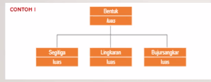

085329866229
aminpadmo@ft.unmul.ac.id
Amin Padmo Azam Masa

# Materi Selanjutnya

- Constructor
- Encapsulation
- Public & Private Keywod
- Polymorphism

# Materi Sekilas

## Konstruktor

Konstruktor adalah <mark>method yang pertama kali dijalankan</mark> saat objek dibuat

## Pewarisan

## Polimorfisme (Polymorphism)

Yaitu sebuah konsep dimana class memiliki banyak "bentuk" method yang berbeda, meskipun namanya sama

Polimorfisme ada dua:

1. Method Overloading
   Class memiliki method yang sama namun <mark>parameter dan tipe data berbeda</mark>
2. Method Overriding
   Nama method, parameter, dan tipe data <mark>sama namun isi berbeda</mark>.

---

Kelas pengganti: Kamis, 9.30