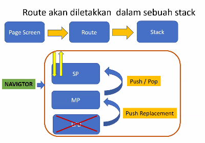

# Navigasi

Navigasi merupakan kunci dari aplikasi berbasis mobile dimana user bisa pindah halaman. Flutter menyediakan kelas `Navigator`


## Routes

Konsep page di Flutter disebut *Route*



Cara lain mendeskripsikan route

```dart
initialRoute: "/",
routes: {
    '/': (context) => const LoginPage(),
    '/dua': (context) => const SecondPage(),
    '/tiga': (context) => const ThirdPage(),
}
```

Sehingga saat menggunakan route cukup panggil sesuai namanya

```dart
Navigator.push(context, '/dua'),
```