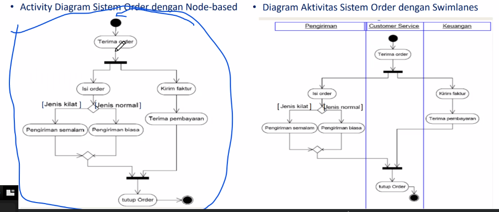

# Activity Diagram

Berhubungan dengan state diagram

## Komponen Activity Diagram

- Initial state, awal dimulainya suatu aliran kerja dan pada sebuah activity diagram hanya terdapat satu initial state
- Final state:
- Fork dan join
  - Fork untuk kegiatan secara paralel
  - Join untuk menunjukkan kegiatan yang digabungkan
- Swimlanes
  
- Guard expression

## Contoh activity Diagram

Kalau aktivitas panjang enak pake swimlanes